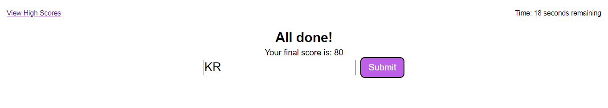

# Coding-Quiz

## Description

To create a resource I could not only show off to potential employers, but learn and improve my knowledge of the document API. I will be able to reuse this project by creating quiz cards of questions for each of the subjects I wish to review. I gives me a resource to continually improve upon. I learned a better understanding of the document, when to make use of calls, and how to create a interactive knowledge base.

## User Story

AS A coding boot camp student  
I WANT to take a timed quiz on JavaScript fundamentals that stores high scores  
SO THAT I can gauge my progress compared to my peers

## Acceptance Criteria

GIVEN I am taking a code quiz  
WHEN I click the start button  
THEN a timer starts and I am presented with a question  
WHEN I answer a question  
THEN I am presented with another question  
WHEN I answer a question incorrectly  
THEN time is subtracted from the clock  
WHEN all questions are answered or the timer reaches 0  
THEN the game is over  
WHEN the game is over  
THEN I can save my initials and score

## Installation

No Need to Install Just go to Link

## Usage

[Link to Deployed Website](https://kevinrhode.github.io/coding-quiz/)
[Link to Repo](https://github.com/KevinRhode/coding-quiz)

## Credits

[Helpful Links - Validate](https://stackoverflow.com/questions/23556533/how-do-i-make-an-input-field-accept-only-letters-in-javascript)  
[Helpful Links - Page Navigation](https://stackoverflow.com/questions/16611497/how-can-i-get-the-name-of-an-html-page-in-javascript)  
[Helpful Links - Sort by Obj Property](https://www.programiz.com/javascript/examples/sort-array-objectsa)

## Features

Coming Soon...